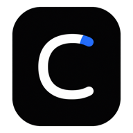
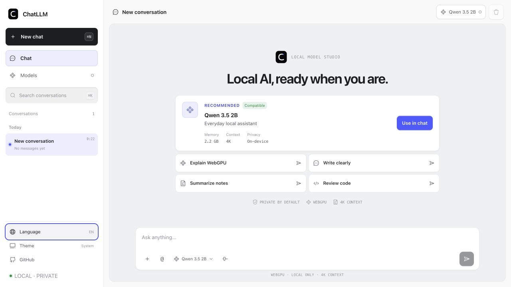
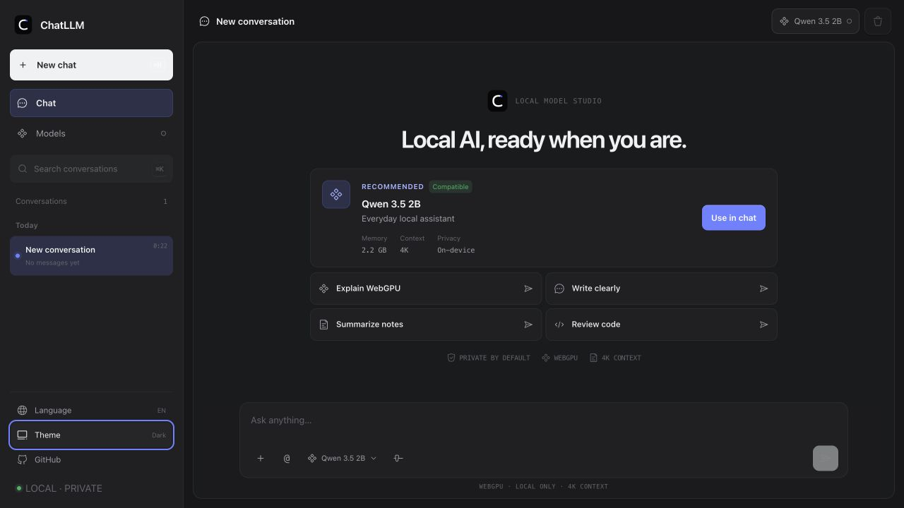
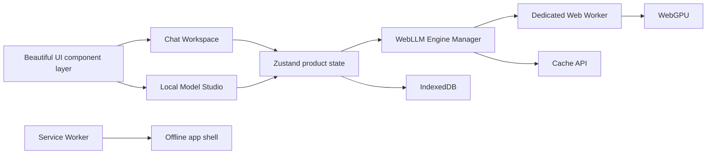

<!-- markdownlint-disable MD013 MD033 MD041 -->

<p align="center">
  
</p>

<h1 align="center">ChatLLM Web</h1>

<p align="center"><strong>A private local model studio and AI chat, powered by WebGPU.</strong></p>

<p align="center">
  <a href="./README.md"><strong>English</strong></a> · <a href="./README.zh-CN.md">简体中文</a>
</p>

<p align="center">
  <a href="https://chatllm-web.pages.dev"><strong>Open ChatLLM</strong></a> ·
  <a href="https://github.com/Ryan-yang125/ChatLLM-Web/releases/latest"><strong>Latest release</strong></a> ·
  <a href="https://github.com/mlc-ai/web-llm"><strong>WebLLM</strong></a> ·
  <a href="https://pages.cloudflare.com/"><strong>Cloudflare Pages</strong></a>
</p>

<p align="center">
  <a href="https://github.com/Ryan-yang125/ChatLLM-Web/releases/latest"></a>
  <a href="./LICENSE"></a>
  
  
</p>

<!-- markdownlint-enable MD013 MD033 MD041 -->



## Local AI as a complete product

ChatLLM Web v3 combines a focused conversation workspace with a complete Local Model Studio. It inspects the current browser, recommends a model, confirms large downloads, streams answers from a dedicated worker, and keeps conversations and files on the device.

- Run five curated language models with the official [MLC WebLLM](https://github.com/mlc-ai/web-llm) runtime.
- See WebGPU, memory, browser storage, compatibility, cache, and runtime status.
- Download, load, switch, unload, retry, and delete models without refreshing the page.
- Attach TXT, Markdown, JSON, and common code files as direct local context.
- Import advanced MLC manifests from approved HTTPS model sources.
- Install the PWA and reuse cached models after the first successful load.
- Use the full interface in English or Simplified Chinese, light or dark.

The static application is served by Cloudflare Pages. Model assets come directly from their declared Hugging Face and WebLLM library URLs. ChatLLM has no application backend, account, API key, analytics, or telemetry.

## Curated model catalog

| Model | WebLLM ID | Declared VRAM | Best for |
| --- | --- | ---: | --- |
| Llama 3.2 1B | `Llama-3.2-1B-Instruct-q4f16_1-MLC` | 879 MB | Fast chat and lower-resource devices |
| Qwen 3.5 0.8B | `Qwen3.5-0.8B-q4f16_1-MLC` | 1.6 GB | Lightweight bilingual tasks |
| Qwen 3.5 2B | `Qwen3.5-2B-q4f16_1-MLC` | 2.2 GB | Default everyday assistant |
| Qwen 3.5 4B | `Qwen3.5-4B-q4f16_1-MLC` | 3.8 GB | Higher-quality general answers |
| Qwen 2.5 Coder 3B | `Qwen2.5-Coder-3B-Instruct-q4f16_1-MLC` | 2.4 GB | Code review and technical work |

Every curated model uses a 4K context window. ChatLLM recommends Qwen 3.5 2B when WebGPU is available and the browser reports at least 8 GB of device memory. Unknown or lower-memory devices start with Llama 3.2 1B. WebGPU features and buffer limits remain part of compatibility checks.

## Chat Workspace

The Beautiful UI–inspired workspace provides streaming Markdown, observable local activity, file context cards, model selection, generation settings, and a compact agent-ready prompt bar.

- `+` adds local files.
- `@` selects files already attached to the current conversation.
- `/` opens Summarize, Explain, Rewrite, and Code presets.
- Enter sends; Shift+Enter adds a line; Stop interrupts generation.
- Each conversation keeps its own model, temperature, top-p, max output, and system prompt.
- When a 4K input budget is exceeded, complete older turns are omitted and the activity trace reports it.



## Local Model Studio

Open `/models` to manage the runtime directly:

- Device insight cards for WebGPU, reported memory, browser storage, and WebLLM.
- Evidence-based model recommendation.
- Filterable built-in and custom model catalog.
- Cache, compatibility, download, load, active, and error states.
- Explicit approvals for model downloads, external WASM, cache deletion, and memory fallback.

<p align="center">
  
</p>

## Local files

ChatLLM reads supported files in the browser and inserts selected text directly into the current request.

| Limit | Value |
| --- | --- |
| Files per request | 4 |
| Size per file | 64 KB |
| Combined context | About 2,048 tokens |
| Supported content | Text, Markdown, JSON, JS/TS, Python, Go, Rust, Java, CSS/HTML, YAML/TOML, SQL, shell |

JSON is validated and formatted. Requests over the context limit are rejected with a visible error. v3 uses complete file text without embeddings or a vector index.

## Custom MLC models

The advanced importer accepts a strict WebLLM `ModelRecord` wrapper:

```json
{
  "schemaVersion": 1,
  "label": "My Local Model",
  "record": {
    "model": "https://huggingface.co/account/model",
    "model_id": "my-model-q4f16-MLC",
    "model_lib": "https://raw.githubusercontent.com/account/repo/main/model.wasm",
    "vram_required_MB": 2048,
    "required_features": ["shader-f16"],
    "overrides": { "context_window_size": 4096 }
  }
}
```

URLs must use HTTPS and match the deployment CSP allowlist for Hugging Face, HF/XetHub, or GitHub Raw. ChatLLM previews the source before external WebAssembly executes.

## Architecture



| Data | Storage | Boundary |
| --- | --- | --- |
| Conversations and messages | IndexedDB | This browser |
| File text and preferences | IndexedDB | This browser |
| Model weights and WASM | WebLLM Cache API | This browser |
| App shell | Service Worker cache | This browser |
| Generation | Dedicated worker + WebGPU | This device |

The Engine Manager owns a single worker and a single active model. Request, conversation, and model identity prevent stale worker events from overwriting newer state. OOM and GPU device-loss paths release the worker and offer a lighter model.

## Early runtime archive

ChatLLM began with a handwritten inference layer before the current WebLLM package existed. The v1 worker, React bridge, types, and runtime configuration are preserved in [`legacy/early-webllm-runtime`](legacy/early-webllm-runtime/README.md). They remain excluded from production builds. The complete original application is available from the [`v1.0.0`](https://github.com/Ryan-yang125/ChatLLM-Web/tree/v1.0.0) tag.

## Develop

Requirements: Node.js 20+ and a current WebGPU-capable browser.

```bash
npm install
npm run dev
```

Quality gates:

```bash
npm run typecheck
npm run lint
npm test
npm run build
npm audit --omit=dev --audit-level=high
```

## Deploy to Cloudflare Pages

```bash
npm run build
npx wrangler pages deploy dist --project-name chatllm-web --branch main
```

Production: [chatllm-web.pages.dev](https://chatllm-web.pages.dev)

Cloudflare headers restrict framing, permissions, scripts, workers, WASM execution, and model connections. The PWA caches the application shell; WebLLM manages model assets separately.

## Credits

- Application code: [MIT](./LICENSE)
- Runtime: [MLC WebLLM](https://github.com/mlc-ai/web-llm)
- Agent-native component source and interaction reference: [Beautiful UI](https://beautiful-ui-five.vercel.app/)
- Interface architecture and motion vocabulary: [Motion Lexicon](https://github.com/Ryan-yang125/motion-lexicon)
- WebGL sweep effects: [Glimm](https://www.npmjs.com/package/glimm)
- Icons: [Iconoir](https://iconoir.com/)

Focused issues and pull requests are welcome. Keep inference local, preserve reduced-motion support, and run every quality gate before submitting.
