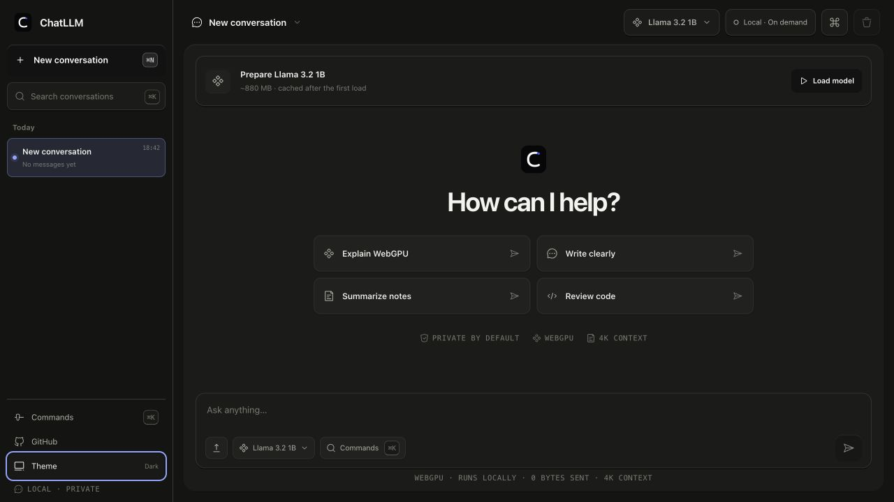
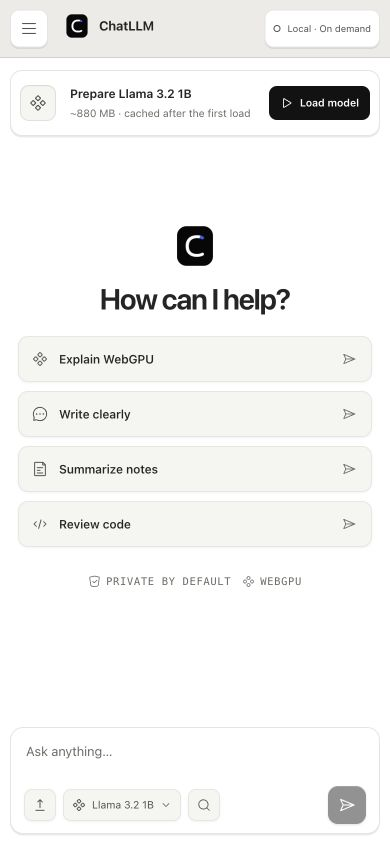
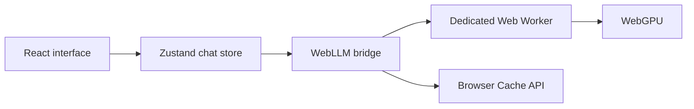

<!-- markdownlint-disable MD013 MD033 MD041 -->

<p align="center">
  
</p>

<h1 align="center">ChatLLM Web</h1>

<p align="center">
  <strong>Private local AI chat, powered by WebGPU.</strong>
</p>

<p align="center">
  <a href="./README.md"><strong>English</strong></a> · <a href="./README.zh-CN.md">简体中文</a>
</p>

<p align="center">
  <a href="https://chatllm-web.pages.dev"><strong>Website</strong></a> ·
  <a href="https://github.com/Ryan-yang125/ChatLLM-Web/releases/latest"><strong>Latest release</strong></a> ·
  <a href="https://github.com/mlc-ai/web-llm"><strong>WebLLM</strong></a> ·
  <a href="https://pages.cloudflare.com/"><strong>Cloudflare Pages</strong></a>
</p>

<p align="center">
  <a href="https://github.com/Ryan-yang125/ChatLLM-Web/releases/latest"></a>
  <a href="./LICENSE"></a>
  
  
</p>

<!-- markdownlint-enable MD013 MD033 MD041 -->


## Private AI, entirely in the browser

ChatLLM runs **Llama 3.2 1B** with the official
[MLC WebLLM](https://github.com/mlc-ai/web-llm) runtime. The model executes in
a dedicated Web Worker and streams answers back to the React interface.

<!-- markdownlint-disable MD013 -->

| Layer | Implementation | Data boundary |
| --- | --- | --- |
| Inference | Llama 3.2 1B · WebLLM · WebGPU | Runs on the local GPU |
| Conversations | Zustand persistent store | Saved in the browser |
| Model files | Hugging Face model assets | Downloaded once, then reused from browser cache |
| Generation | Streaming completion API | Prompts and responses stay on the device |

<!-- markdownlint-enable MD013 -->

There is no application backend, account, or API key. The static application is
served from Cloudflare Pages; model assets are fetched directly by the browser.

## Start chatting

Open [chatllm-web.pages.dev](https://chatllm-web.pages.dev) in a current Chrome
or Edge browser with WebGPU and hardware acceleration enabled.

The first model preparation downloads approximately **880 MB**. Later sessions
reuse the browser cache. The current model uses a **4K context window** and needs
roughly **1 GB of available GPU memory**.

## Product workflow

- Create, search, switch, clear, and delete local conversations.
- Start from a focused prompt suggestion or write directly in the composer.
- Stream Markdown with tables, code highlighting, copy/download actions, and math.
- Open the Command-K palette for navigation, appearance, and local actions.
- Follow model download progress, cancel preparation, interrupt generation, or retry.
- Install the PWA and use the same interface across desktop and mobile layouts.



## Keyboard-first controls

<!-- markdownlint-disable MD013 MD033 -->

| Shortcut | Action |
| --- | --- |
| <kbd>⌘</kbd>/<kbd>Ctrl</kbd> + <kbd>K</kbd> | Open the command palette |
| <kbd>⌘</kbd>/<kbd>Ctrl</kbd> + <kbd>N</kbd> | Create a conversation |
| <kbd>Enter</kbd> | Send a message |
| <kbd>Shift</kbd> + <kbd>Enter</kbd> | Add a new line |
| <kbd>Esc</kbd> | Close the active overlay |

<p align="center">
  
</p>

<!-- markdownlint-enable MD013 MD033 -->

## Architecture



The WebLLM client is loaded only when model preparation begins. The application
shell, motion system, and conversation UI stay lightweight, while the model
runtime and Markdown renderer ship as separate lazy chunks.

## Project structure

```text
src/components/    Chat workspace, sidebar, command palette, Markdown, theme
src/lib/           Chat utilities and the WebLLM bridge
src/store/         Persistent conversation and generation state
src/workers/       Dedicated WebLLM worker entrypoint
src/types/         Product data types
public/brand/      App mark and install icons
public/_headers    Cloudflare security and cache policy
tests/             Utility and behavior tests
```

ChatLLM is a static React + TypeScript application. Vite builds the app, worker,
PWA service worker, and Cloudflare Pages assets into `dist/`.

```bash
npm install
npm run dev
npm run build
```

## Quality gates

```bash
npm run typecheck
npm run lint
npm test
npm run build
npm audit --omit=dev --audit-level=high
```

Browser QA covers the desktop and mobile layouts, conversation lifecycle,
Command-K palette, themes, model preparation, cancellation, and production
security headers.

## Deploy to Cloudflare Pages

```bash
npm run build
npx wrangler pages deploy dist --project-name chatllm-web --branch main
```

Production: [chatllm-web.pages.dev](https://chatllm-web.pages.dev)

## Browser support and privacy

- Use a current Chromium browser with WebGPU enabled.
- Prompts, responses, and conversation history remain in the browser.
- Clearing browser site data removes local conversations and cached model files.
- Loading the model connects to its Hugging Face and model-library URLs.
- The Cloudflare deployment applies CSP, frame protection, HSTS, and a
  restricted permissions policy.

## Contributing

Issues and focused pull requests are welcome. Keep product behavior local-first,
preserve reduced-motion support, and run every quality gate before submitting.

## License and acknowledgments

- Application code: [MIT](./LICENSE)
- Local model runtime: [MLC WebLLM](https://github.com/mlc-ai/web-llm)
- Interface and motion system: [Motion Lexicon](https://github.com/Ryan-yang125/motion-lexicon)
- Icons: [Iconoir](https://iconoir.com/)
- Model: [Meta Llama 3.2](https://huggingface.co/meta-llama)
