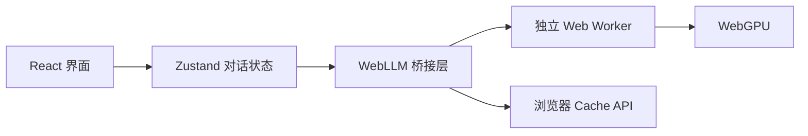

<!-- markdownlint-disable MD013 MD033 MD041 -->

<p align="center">
  
</p>

<h1 align="center">ChatLLM Web</h1>

<p align="center">
  <strong>由 WebGPU 驱动的本地隐私 AI 对话应用。</strong>
</p>

<p align="center">
  <a href="./README.md">English</a> · <a href="./README.zh-CN.md"><strong>简体中文</strong></a>
</p>

<p align="center">
  <a href="https://chatllm-web.pages.dev"><strong>在线体验</strong></a> ·
  <a href="https://github.com/Ryan-yang125/ChatLLM-Web/releases/latest"><strong>最新版本</strong></a> ·
  <a href="https://github.com/mlc-ai/web-llm"><strong>WebLLM</strong></a> ·
  <a href="https://pages.cloudflare.com/"><strong>Cloudflare Pages</strong></a>
</p>

<p align="center">
  <a href="https://github.com/Ryan-yang125/ChatLLM-Web/releases/latest"></a>
  <a href="./LICENSE"></a>
  
  
</p>

<!-- markdownlint-enable MD013 MD033 MD041 -->


## 完全运行在浏览器里的隐私 AI

ChatLLM 使用官方 [MLC WebLLM](https://github.com/mlc-ai/web-llm) 运行
**Llama 3.2 1B**。模型在独立 Web Worker 中执行，并将生成内容实时返回 React 界面。

| 层级 | 实现 | 数据边界 |
| --- | --- | --- |
| 推理 | Llama 3.2 1B · WebLLM · WebGPU | 在本地 GPU 运行 |
| 对话 | Zustand 持久化 Store | 保存在浏览器中 |
| 模型文件 | Hugging Face 模型资源 | 首次下载，后续使用浏览器缓存 |
| 内容生成 | 流式 Completion API | 提示词和回答留在设备中 |

应用无需后端、账号或 API Key。静态页面由 Cloudflare Pages 提供，模型资源由浏览器直接获取。

## 开始对话

使用开启 WebGPU 和硬件加速的新版 Chrome 或 Edge，打开
[chatllm-web.pages.dev](https://chatllm-web.pages.dev)。

第一次准备模型需要下载约 **880 MB**，后续会复用浏览器缓存。当前模型提供
**4K 上下文窗口**，建议设备拥有约 **1 GB 可用 GPU 内存**。

## 产品能力

- 创建、搜索、切换、清空和删除本地对话。
- 从精选提示开始，或直接在输入框中提问。
- 流式渲染 Markdown、表格、代码高亮、复制/下载操作和数学公式。
- 使用 Command-K 命令面板完成导航、外观切换和本地操作。
- 查看模型下载进度、取消准备、停止生成并在失败后重试。
- 安装 PWA，在桌面端和移动端使用一致的界面。


## 键盘操作

<!-- markdownlint-disable MD013 MD033 -->

| 快捷键 | 操作 |
| --- | --- |
| <kbd>⌘</kbd>/<kbd>Ctrl</kbd> + <kbd>K</kbd> | 打开命令面板 |
| <kbd>⌘</kbd>/<kbd>Ctrl</kbd> + <kbd>N</kbd> | 新建对话 |
| <kbd>Enter</kbd> | 发送消息 |
| <kbd>Shift</kbd> + <kbd>Enter</kbd> | 输入换行 |
| <kbd>Esc</kbd> | 关闭当前浮层 |

<p align="center">
  
</p>

<!-- markdownlint-enable MD013 MD033 -->

## 架构



WebLLM 客户端会在用户开始准备模型时加载。应用外壳、动效系统和对话界面保持轻量，
模型运行时与 Markdown 渲染器分别通过延迟 Chunk 加载。

## 项目结构

```text
src/components/    对话工作区、侧边栏、命令面板、Markdown、主题
src/lib/           对话工具和 WebLLM 桥接层
src/store/         持久化对话与生成状态
src/workers/       WebLLM Worker 入口
src/types/         产品数据类型
public/brand/      品牌图标和安装图标
public/_headers    Cloudflare 安全与缓存策略
tests/             工具和行为测试
```

ChatLLM 是静态 React + TypeScript 应用。Vite 将应用、Worker、PWA Service Worker
和 Cloudflare Pages 资源构建到 `dist/`。

```bash
npm install
npm run dev
npm run build
```

## 质量门禁

```bash
npm run typecheck
npm run lint
npm test
npm run build
npm audit --omit=dev --audit-level=high
```

浏览器验收覆盖桌面端与移动端布局、对话生命周期、Command-K 命令面板、主题、
模型准备、取消操作和生产环境安全响应头。

## 部署到 Cloudflare Pages

```bash
npm run build
npx wrangler pages deploy dist --project-name chatllm-web --branch main
```

生产环境：[chatllm-web.pages.dev](https://chatllm-web.pages.dev)

## 浏览器支持与隐私

- 使用支持 WebGPU 的新版 Chromium 浏览器。
- 提示词、回答和对话历史保存在浏览器中。
- 清除站点数据会移除本地对话与模型缓存。
- 加载模型时会连接对应的 Hugging Face 与模型运行库地址。
- Cloudflare 部署启用了 CSP、页面嵌入保护、HSTS 和受限权限策略。

## 参与贡献

欢迎提交 Issue 和目标清晰的 Pull Request。请保持本地优先的产品边界、保留减少动态效果支持，
并在提交前运行全部质量门禁。

## 许可证与致谢

- 应用代码：[MIT](./LICENSE)
- 本地模型运行时：[MLC WebLLM](https://github.com/mlc-ai/web-llm)
- 界面与动效系统：[Motion Lexicon](https://github.com/Ryan-yang125/motion-lexicon)
- 图标：[Iconoir](https://iconoir.com/)
- 模型：[Meta Llama 3.2](https://huggingface.co/meta-llama)
