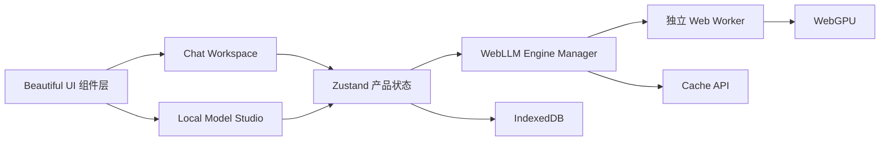

<!-- markdownlint-disable MD013 MD033 MD041 -->

<p align="center"></p>
<h1 align="center">ChatLLM Web</h1>
<p align="center"><strong>由 WebGPU 驱动的隐私本地模型工作台与 AI 对话应用。</strong></p>
<p align="center"><a href="./README.md">English</a> · <a href="./README.zh-CN.md"><strong>简体中文</strong></a></p>
<p align="center">
  <a href="https://chatllm-web.pages.dev"><strong>打开 ChatLLM</strong></a> ·
  <a href="https://github.com/Ryan-yang125/ChatLLM-Web/releases/latest"><strong>最新版本</strong></a> ·
  <a href="https://github.com/mlc-ai/web-llm"><strong>WebLLM</strong></a> ·
  <a href="https://pages.cloudflare.com/"><strong>Cloudflare Pages</strong></a>
</p>

<!-- markdownlint-enable MD013 MD033 MD041 -->


## 浏览器里的 Local Model Studio

ChatLLM Web v3 将专注的对话工作区与完整的本地模型管理结合在一起。应用会检测当前浏览器、推荐合适模型、确认大文件下载、通过独立 Worker 流式生成，并将对话和文件保存在设备上。

- 使用官方 MLC WebLLM 运行五个精选模型。
- 查看 WebGPU、设备内存、浏览器存储、兼容性、缓存和运行状态。
- 无需刷新页面即可下载、加载、切换、卸载和删除模型。
- 将文本、Markdown、JSON 和常见代码文件直接加入本地上下文。
- 导入来自受信 HTTPS 来源的高级 MLC 模型清单。
- 安装 PWA，并在首次成功缓存后离线打开应用与模型。
- 支持中英文、深浅主题和减少动态效果。

应用由 Cloudflare Pages 提供静态页面，没有应用后端、账号、API Key、分析与遥测。模型资源由浏览器直接从清单声明的 Hugging Face 与 WebLLM 地址下载。

## 精选模型

| 模型 | WebLLM ID | 显存需求 | 适用场景 |
| --- | --- | ---: | --- |
| Llama 3.2 1B | `Llama-3.2-1B-Instruct-q4f16_1-MLC` | 879 MB | 低资源设备与快速对话 |
| Qwen 3.5 0.8B | `Qwen3.5-0.8B-q4f16_1-MLC` | 1.6 GB | 中英文轻量任务 |
| Qwen 3.5 2B | `Qwen3.5-2B-q4f16_1-MLC` | 2.2 GB | 默认通用助手 |
| Qwen 3.5 4B | `Qwen3.5-4B-q4f16_1-MLC` | 3.8 GB | 更高质量的通用回答 |
| Qwen 2.5 Coder 3B | `Qwen2.5-Coder-3B-Instruct-q4f16_1-MLC` | 2.4 GB | 编程、审查与代码解释 |

所有精选模型使用 4K 上下文。浏览器支持 WebGPU 且报告至少 8 GB 设备内存时，ChatLLM 推荐 Qwen 3.5 2B；设备信息未知或内存较低时推荐 Llama 3.2 1B。WebGPU features 与 buffer limits 同样参与兼容性判断。

## Chat Workspace

对话工作区采用 Beautiful UI 的 agent-native 组件语言，提供流式 Markdown、本地活动轨迹、文件卡片、模型选择、生成设置与紧凑 Prompt Bar。

- `+` 添加本地文件。
- `@` 选择当前对话已有文件。
- `/` 打开 Summarize、Explain、Rewrite 与 Code 预设。
- Enter 发送，Shift+Enter 换行，Stop 中断生成。
- 每个对话独立保存模型、temperature、top-p、最大输出和 system prompt。
- 输入超过 4K 预算时移除最早的完整对话轮次，并在活动轨迹中显示提示。


## Local Model Studio

访问 `/models` 管理本地运行时：

- WebGPU、设备内存、浏览器存储和 WebLLM 状态卡片。
- 由真实设备信息驱动的模型推荐。
- 可筛选的内置与自定义模型目录。
- 缓存、兼容、下载、加载、活动和错误状态。
- 模型下载、外部 WASM、删除缓存和低内存降级确认。

<p align="center"></p>

## 本地文件上下文

| 限制 | 数值 |
| --- | --- |
| 单次文件数量 | 4 |
| 单文件大小 | 64 KB |
| 合计上下文 | 约 2,048 tokens |
| 支持内容 | 文本、Markdown、JSON、JS/TS、Python、Go、Rust、Java、CSS/HTML、YAML/TOML、SQL、Shell |

JSON 会先验证并格式化。超过上下文限制时直接显示错误。v3 使用完整文件文本，不创建 embedding、向量索引或 RAG。

## 自定义 MLC 模型

高级导入器接受严格的 WebLLM `ModelRecord` 包装：

```json
{
  "schemaVersion": 1,
  "label": "My Local Model",
  "record": {
    "model": "https://huggingface.co/account/model",
    "model_id": "my-model-q4f16-MLC",
    "model_lib": "https://raw.githubusercontent.com/account/repo/main/model.wasm",
    "vram_required_MB": 2048,
    "required_features": ["shader-f16"],
    "overrides": { "context_window_size": 4096 }
  }
}
```

URL 必须使用 HTTPS，并符合 Hugging Face、HF/XetHub 或 GitHub Raw 的 CSP 允许范围。执行外部 WebAssembly 前会显示来源确认。

## 架构



| 数据 | 存储 | 边界 |
| --- | --- | --- |
| 对话与消息 | IndexedDB | 当前浏览器 |
| 文件文本与偏好 | IndexedDB | 当前浏览器 |
| 模型权重与 WASM | WebLLM Cache API | 当前浏览器 |
| 应用壳 | Service Worker cache | 当前浏览器 |
| 生成 | 独立 Worker + WebGPU | 当前设备 |

Engine Manager 统一管理一个 Worker 和一个活动模型。request、conversation 与 model identity 会阻止过期事件覆盖新状态。OOM 与 GPU device lost 会释放 Worker，并提供轻量模型选择。

## 早期手写推理层

ChatLLM 诞生时，当前 WebLLM 包尚未提供这套生产运行时。v1 的 Worker、React 桥接、类型与配置保存在 [`legacy/early-webllm-runtime`](legacy/early-webllm-runtime/README.md)，并退出生产构建。完整原版应用保留在 [`v1.0.0`](https://github.com/Ryan-yang125/ChatLLM-Web/tree/v1.0.0) tag。

## 本地开发与质量门禁

需要 Node.js 20+ 与支持 WebGPU 的新版浏览器。

```bash
npm install
npm run dev
npm run typecheck
npm run lint
npm test
npm run build
npm audit --omit=dev --audit-level=high
```

## 部署到 Cloudflare Pages

```bash
npm run build
npx wrangler pages deploy dist --project-name chatllm-web --branch main
```

生产地址：[chatllm-web.pages.dev](https://chatllm-web.pages.dev)

## 致谢

- 应用代码：[MIT](./LICENSE)
- 本地模型运行时：[MLC WebLLM](https://github.com/mlc-ai/web-llm)
- Agent-native 组件源码与交互参考：[Beautiful UI](https://beautiful-ui-five.vercel.app/)
- 界面架构与动效词汇：[Motion Lexicon](https://github.com/Ryan-yang125/motion-lexicon)
- WebGL 扫光：[Glimm](https://www.npmjs.com/package/glimm)
- 图标：[Iconoir](https://iconoir.com/)

欢迎提交目标清晰的 Issue 与 Pull Request。请保持本地推理、减少动态效果支持，并在提交前运行全部质量门禁。
