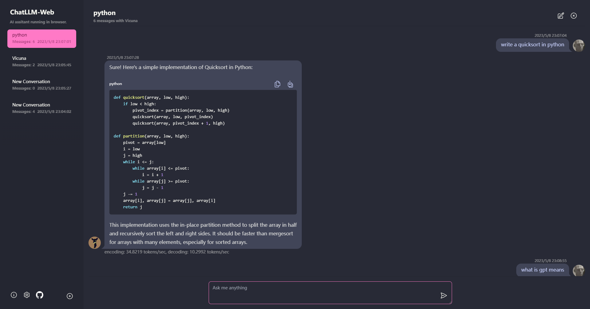
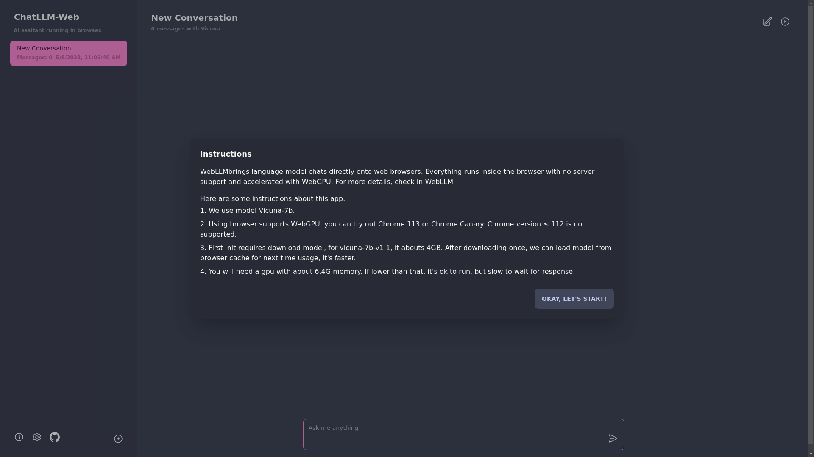
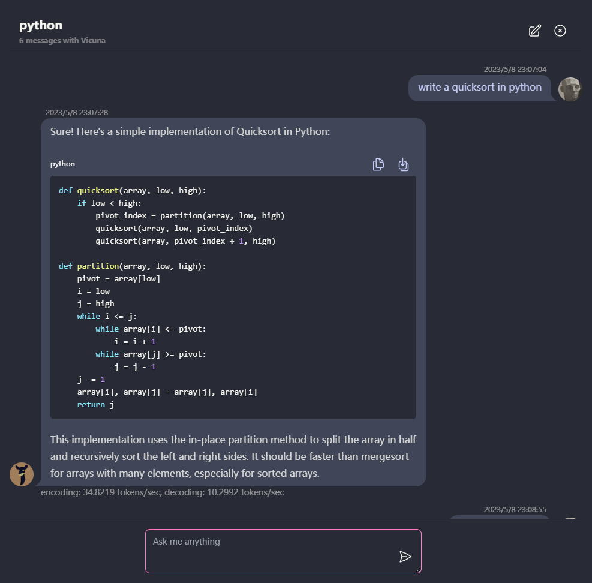

<div align="center">


<h1 align="center">ChatLLM Web</h1>

[English](../README.md) / [简体中文](./README_CN.md) / 日本語

🗣️ Vicuna のような LLM と、WebGPU を使ってブラウザ上で安全に変えるかつプライベートに、そしてサーバを介さずに完全にチャットすることができます。[web-llm](https://github.com/mlc-ai/web-llm) を搭載。

[Try it now](https://chat-llm-web.vercel.app)



</div>

## 特徴

- 🤖 **サーバーサポートなし** ですべてがブラウザ内で実行され、**WebGPU で加速されます**。

- ⚙️ モデルはウェブワーカーで実行されるため、ユーザーインターフェイスをブロックすることなく、シームレスなエクスペリエンスを提供します。

- 🚀 Vercel のワンクリックで1分以内に無料で簡単にデプロイでき、その後、あなた自身の ChatLLM Web を手に入れることができます。

- 💾 モデルのキャッシュがサポートされているので、モデルのダウンロードは一度のみでよい。

- 💬 マルチ会話チャットは、全てのデータがブラウザにローカルに保存され、プライバシーが守られます。

- 📝 Markdown とストリーミングレスポンスのサポート: 数学、コードハイライトなど。

- 🎨 ダークモードを含む、レスポンシブでデザイン性の高い UI。

- 💻 PWA に対応し、ダウンロードして完全にオフラインで実行できます。

## 使用方法

- 🌐 このアプリを使用するには、Chrome 113 や Chrome Canary など、WebGPU をサポートするブラウザが必要です。Chrome のバージョン ≦ 112 はサポートされていません。

- 💻 約 6.4GB のメモリを搭載した GPU が必要です。GPU のメモリが少ない場合でも、アプリは実行されますが、応答時間は遅くなります。

- 📥 初めてアプリを使用する際は、モデルのダウンロードが必要です。現在使用している Vicuna-7b モデルの場合、ダウンロードサイズは約 4GB です。初回ダウンロード後は、ブラウザのキャッシュからモデルを読み込むことで、より高速に使用することができます。

- ℹ️ 詳細は [mlc.ai/web-llm](https://mlc.ai/web-llm/) をご参照ください

## ロードマップ

- [✅] LLM: Web Workerを使用してLLMインスタンスを作成し、回答を生成する。

- [✅] 会話: Multi-conversation に対応しています

- [✅] PWA

- [] Settings:
  - ui: ダーク/ライトテーマ
  - デバイス:
    - gpu デバイスの選択
    - キャッシュの使用量と管理
  - モデル:
    - マルチモデル対応: vicuna-7b✅ RedPajama-INCITE-Chat-3B []
    - パラメータ設定: temperature, max-length など。
    - モデルのエクスポートとインポート

## Vercel へのデプロイ

1. クリック
   [](https://vercel.com/new/clone?repository-url=https%3A%2F%2Fgithub.com%2FRyan-yang125%2FChatLLM-Web&project-name=chat-llm-web&repository-name=ChatLLM-Web)の指示に従うことで、わずか1分で終了します。
2. 楽しんでください 😊

## デプロイ

```shell
git clone https://github.com/Ryan-yang125/ChatLLM-Web.git
cd ChatLLM-Web
npm i
npm run dev
```

## スクリーンショット





## ライセンス

[MIT](./LICENSE)
